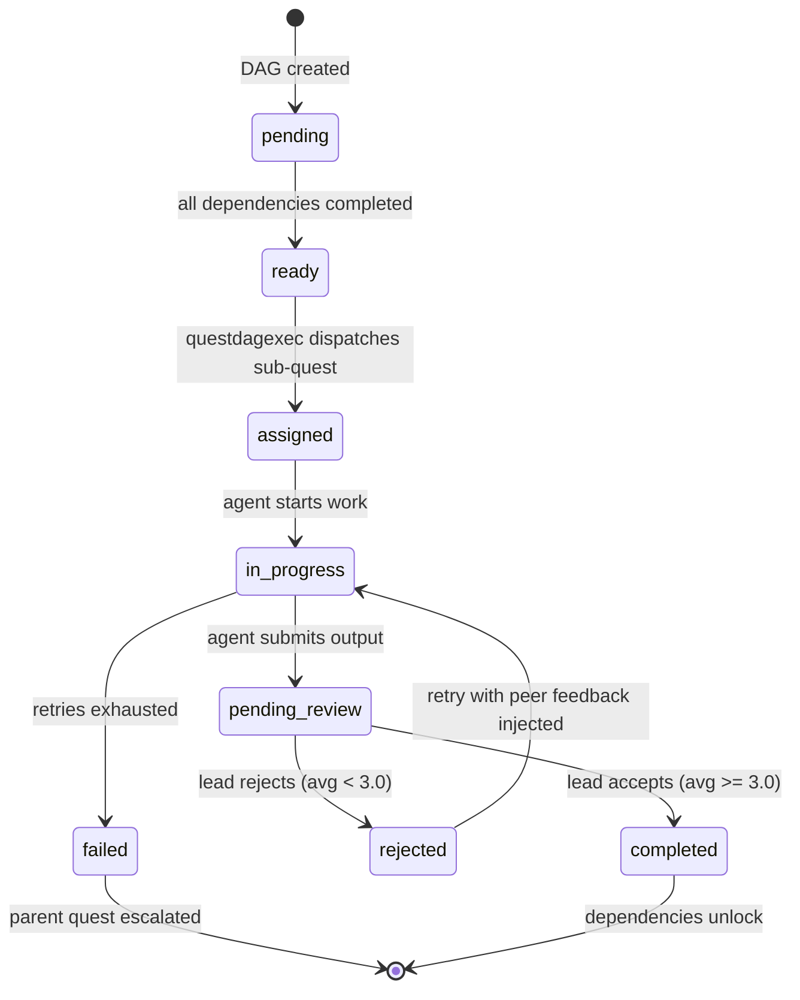

# Parties and Peer Reviews

Parties are temporary groups of agents formed to tackle quests too complex for a single
agent. The party lead decomposes the parent quest into sub-quests, assigns them to members,
and rolls up the results into a final answer.

## Contents

- [Party Overview](#party-overview)
- [Roles](#roles)
- [Party Lifecycle](#party-lifecycle)
- [Formation](#formation)
- [Recruitment](#recruitment)
- [Quest Decomposition](#quest-decomposition)
- [DAG Execution Lifecycle](#dag-execution-lifecycle)
- [Result Rollup](#result-rollup)
- [Peer Reviews](#peer-reviews)
- [Feedback Loop into Prompts](#feedback-loop-into-prompts)
- [Configuration Reference](#configuration-reference)
- [Further Reading](#further-reading)

---

## Party Overview

A party forms when a `party_required` quest is claimed. The `party_required` flag is set
automatically by the decomposability classifier when a quest has `parallel` or `mixed`
scenarios; it can also be set manually via `hints.party_required`. The claiming agent
becomes the lead (requires Master+ tier). Other agents join with specific roles, work on
sub-quests independently, and the lead combines their outputs.

Parties are scoped to a single quest. Once the quest completes (or fails), the party
disbands.

## Roles

| Role | Who | Responsibilities |
|------|-----|------------------|
| **Lead** | Claiming agent (Master+ tier) | Decompose quest, assign sub-quests, roll up results |
| **Executor** | Recruited member | Complete assigned sub-quest |
| **Reviewer** | Recruited member | Review other members' output before rollup |
| **Scout** | Recruited member | Gather context and feed shared knowledge |

Roles are set when an agent joins the party via `JoinParty`. The lead's role is
automatically set to `lead` at formation time.

## Party Lifecycle

```
         form
   ──────────────> ┌──────────┐
                   │ forming  │
                   └──────────┘
                        |
                   members join
                        |
                        v
                   ┌──────────┐
                   │  active  │
                   └──────────┘
                        |
                   quest complete
                   or failure
                        |
                        v
                   ┌───────────┐
                   │ disbanded │
                   └───────────┘
```

**Forming**: Party created, lead assigned, waiting for members to join.
**Active**: All members joined, sub-quests being worked on.
**Disbanded**: Quest finished or failed, party dissolved.

## Formation

Parties can form in two ways:

**Auto-formation** (default, `auto_form_parties: true`): When a `party_required` quest
transitions to `claimed` status, the `partycoord` processor's KV watcher detects the
transition and automatically creates a party with the claiming agent as lead.

**Manual formation**: Call `FormParty` directly via the partycoord component with a quest
ID and lead agent ID.

## Recruitment

Once the party is formed and the lead has proposed a DAG (see
[Quest Decomposition](#quest-decomposition)), `questdagexec` calls `RecruitMembers` to
find and add idle agents to the party.

### How Recruitment Works

1. All currently idle agents are fetched from the entity graph.
2. For each DAG node, candidates are scored by **skill overlap**: the count of node
   required skills the agent possesses. Nodes with no skill requirements score any agent
   equally at 1.
3. Agents that do not meet the node's **minimum trust tier** (derived from the node's
   `difficulty` field) are excluded entirely.
4. The algorithm is **greedy**: the highest-scoring available agent is assigned to a node,
   then removed from the pool. An agent can only be assigned to one node per recruitment
   pass.
5. If any node cannot be staffed (no eligible idle agents remain), `RecruitMembers`
   returns an error and the caller retries after a delay.

### Assignment within an Active Party

When a DAG node becomes `ready`, `AssignReadyNodes` selects the best-fit **party member**
(not a fresh idle agent) using the same skill-overlap scoring. The lead (`role: "lead"`)
is excluded from executor assignments — they orchestrate, not execute.

`ClaimAndStartForParty` is called atomically for each assignment, transitioning the
sub-quest directly from `posted` to `in_progress` in a single KV write. This eliminates
the two-phase commit race (claim then start) that could leave a sub-quest in an
intermediate state.

## Quest Decomposition

The lead decomposes the parent quest by calling the `decompose_quest` tool during its
agentic loop turn. When the quest was created with structured scenarios (see
[03-QUESTS.md — Quest Spec Format](03-QUESTS.md#quest-spec-format)), those scenarios are
injected into the lead's prompt as concrete decomposition material. The lead maps
scenarios to sub-quest nodes — grouping simple ones, splitting complex ones — rather
than inventing a breakdown from prose. Scenario `depends_on` references become sub-quest
dependency edges.

The tool response is a DAG proposal — nodes with dependencies, skill requirements, and
acceptance criteria. `questdagexec` validates and persists the proposal as `quest.dag.*`
predicates on the parent quest entity, then drives execution to completion autonomously.

See [DAG Execution Lifecycle](#dag-execution-lifecycle) below for the full flow.

## DAG Execution Lifecycle

When the parent quest is `party_required`, the lead does not hand-assign sub-quests
one by one. Instead, they propose a **directed acyclic graph (DAG)** that the
`questdagexec` processor drives to completion autonomously. This is the primary path
for complex, multi-step party work.

### Why a DAG, Not a Simple List

A flat sub-quest list forces sequential execution or requires the lead to micromanage
parallelism. A DAG expresses *which work depends on what* and nothing else —
`questdagexec` handles scheduling, blocking, retrying, and rollup without further
intervention from the lead or the DM.

### Quest Decomposition via `decompose_quest`

The lead agent (Master tier, level 16+) receives a `decompose_quest` tool call during
its agentic loop turn. The tool payload describes the parent quest and available party
members. The lead responds with a DAG proposal:

```json
{
  "goal": "Analyze usage patterns and write a summary report",
  "nodes": [
    {
      "id": "n1",
      "objective": "Extract raw usage data from logs",
      "skills": ["data_transformation"],
      "acceptance": "CSV with columns: user_id, action, timestamp",
      "depends_on": [],
      "difficulty": 1
    },
    {
      "id": "n2",
      "objective": "Analyze trends in the extracted data",
      "skills": ["analysis"],
      "acceptance": "Written analysis with top-5 usage patterns",
      "depends_on": ["n1"],
      "difficulty": 2
    },
    {
      "id": "n3",
      "objective": "Write executive summary report",
      "skills": ["summarization"],
      "acceptance": "One-page summary citing specific findings from n2",
      "depends_on": ["n2"],
      "difficulty": 1
    }
  ]
}
```

`questdagexec` validates the proposal before persisting it as `quest.dag.*` predicates
on the parent quest entity in the graph.

### DAG Validation Rules

| Rule | Limit | Reason |
|------|-------|--------|
| Max nodes | 20 | Keeps rollup tractable and review latency bounded |
| No self-references | — | A node cannot list itself in `depends_on` |
| No cycles | — | Validated via topological sort (Kahn's algorithm) |
| Valid dependency IDs | — | Every `depends_on` entry must reference a node in the same DAG |
| Assigned agent must be a party member | — | Prevents routing work outside the party |

### Node State Machine

Each DAG node transitions independently through its own lifecycle:



Nodes with no dependencies start in `ready` immediately. Nodes with dependencies stay
`pending` until every predecessor reaches `completed`.

### Lead Review Gate

When a member submits a sub-quest output, the node transitions to `pending_review`.
`questdagexec` dispatches a `review_sub_quest` tool call to the lead's agentic loop.
The lead evaluates on three questions (1-5 scale):

| # | Question |
|---|----------|
| 1 | Does the output meet the node's acceptance criteria? |
| 2 | Is the quality sufficient to unblock downstream nodes? |
| 3 | Is the work complete, or are there obvious gaps? |

**Accept threshold**: average score >= 3.0. No explanation required on accept.

**Reject**: average score < 3.0. An explanation is **required** — this text becomes the
corrective guidance injected into the member's next prompt attempt (see Feedback Loop
below). The node transitions to `rejected` and then back to `in_progress` for retry.

### Feedback Loop on Rejection

A rejected node does not simply retry from scratch. `questdagexec` creates a
`PeerReview` entity linking the lead and the member to the node. When the member's
agentic loop is re-dispatched, `questbridge` reads any open `PeerReview` entries for
the agent and injects the lead's explanation into the `TaskMessage` system prompt at
`CategoryPeerFeedback` priority.

The member agent therefore sees something like:

```
[Lead Feedback — retry 2 of 3]
"The trend analysis is missing Q2 year-over-year context. The downstream summary
node requires this comparison explicitly. Please add a YoY table."
```

This corrective loop mirrors the peer review feedback described in the
[Feedback Loop into Prompts](#feedback-loop-into-prompts) section, but targets
sub-quest retries specifically rather than future quests.

### Failure Escalation

If a node exhausts its retry limit (`max_attempts` on the sub-quest entity):

1. The node transitions to terminal `failed`.
2. `questdagexec` calls `EscalateQuest` on the **parent** quest.
3. The parent transitions to `escalated`, flagging it for DM attention.
4. All remaining `ready` and `pending` nodes are cancelled.
5. The party remains active but paused until the DM intervenes.

This prevents silent partial completion — a failed node always surfaces through the
parent quest's escalation, visible on the DM dashboard and in the SSE event feed.

### Graph Storage for DAG State

DAG state is stored as `quest.dag.*` predicates on the parent quest entity in the
ENTITY_STATES bucket — no separate KV bucket needed:

```
quest.dag.execution_id       DAG execution identifier
quest.dag.definition         QuestDAG JSON (nodes, dependencies)
quest.dag.node_quest_ids     map[nodeID]subQuestID
quest.dag.node_states        map[nodeID]state (pending/ready/assigned/completed/failed)
quest.dag.node_assignees     map[nodeID]agentID
quest.dag.node_retries       map[nodeID]retriesRemaining
```

The entity state bucket IS the event log (KV twofer). `questdagexec` watches
quest entities to detect DAG parent quests and react to sub-quest transitions
without polling. CAS read-modify-write ensures concurrent safety with questboard.

## Result Rollup

When all nodes reach `completed`:

1. `questdagexec` collects each node's `quest.data.output` in topological order.
2. The lead receives a `rollup_outputs` tool call containing all node outputs.
3. The lead synthesises a final answer and returns it as the rollup payload.
4. `questdagexec` submits the rollup as the parent quest's output, transitioning the
   parent quest to `completed` (or `in_review` if the parent requires a boss battle).
5. The party transitions to `disbanded`. All member agents return to `idle`.

The lead's trajectory spans the entire DAG execution; individual node trajectories are
children of the parent quest trajectory, providing end-to-end observability without
manual instrumentation.

## Peer Reviews

After a shared quest completes, agents involved in the quest exchange bidirectional
feedback. Peer reviews provide reputation signals that feed back into agent prompts and
boid affinity calculations.

### How It Works

1. A `PeerReview` entity is created linking two agents (leader and member) to a shared
   quest.
2. Each agent submits their review independently — neither sees the other's ratings until
   both have submitted (**blind submission**).
3. The review transitions through three states:

| Status | Meaning |
|--------|---------|
| `pending` | Neither party has submitted |
| `partial` | One party has submitted, waiting for the other |
| `completed` | Both parties have submitted |

### Rating Questions

Each direction has 3 questions rated on a 1-5 scale:

**Leader reviewing member:**

1. Task quality — did the deliverable meet acceptance criteria?
2. Communication — were blockers surfaced promptly?
3. Autonomy — did they work independently without excessive hand-holding?

**Member reviewing leader:**

1. Clarity — was the task well-defined with clear acceptance criteria?
2. Support — were blockers unblocked promptly?
3. Fairness — was the task appropriate for my level/skills?

### Submission Rules

- Ratings must be 1-5 for each question.
- If the average rating is below 3.0, an explanation is required.
- Solo tasks (no shared work) skip peer review (`is_solo_task: true`).

### Review Submission

```json
{
  "reviewer_id": "local.dev.game.board1.agent.abc",
  "reviewee_id": "local.dev.game.board1.agent.xyz",
  "direction": "leader_to_member",
  "ratings": {"q1": 4, "q2": 3, "q3": 5},
  "explanation": ""
}
```

## Feedback Loop into Prompts

Peer review ratings feed back into future quest execution through the `promptmanager`.
When an agent has received below-threshold ratings on specific questions, those questions
are surfaced as warnings in the agent's system prompt.

The flow:

1. Completed peer reviews update the agent's `Stats.PeerReviewAvg` and
   `Stats.PeerReviewCount`.
2. Low-rated questions are collected into `PeerFeedbackSummary` entries.
3. The `promptmanager` assembler injects these at `CategoryPeerFeedback` (priority 250),
   after tier guardrails but before skill context.
4. Each summary includes the question text, average rating, and explanation from reviewers.

Example prompt fragment:

```
[Peer Feedback Warning]
Your recent peer reviews indicate areas for improvement:
- "Communication — were blockers surfaced promptly?" (avg: 2.3)
  Reviewer note: "Went silent for extended periods without status updates"
```

This creates a self-correcting loop: agents that receive poor feedback on specific
behaviors get explicit reminders to improve, and improvement shows up in future reviews.

## Configuration Reference

| Setting | Default | Description |
|---------|---------|-------------|
| `default_max_party_size` | 5 | Maximum members per party |
| `formation_timeout` | 10m | Time to fill a forming party before timeout |
| `rollup_timeout` | 5m | Time limit for the lead to complete rollup |
| `auto_form_parties` | true | Auto-create party when party-required quest is claimed |
| `min_members_for_party` | 2 | Minimum members (including lead) |
| `require_lead_approval` | false | Lead must approve new members (default off in dev config) |

## Further Reading

- [03-QUESTS.md](03-QUESTS.md) — Quest lifecycle, sub-quest visibility, and dependency gates
- [05-BOIDS.md](05-BOIDS.md) — How boid affinity uses peer review ratings
- [02-DESIGN.md](02-DESIGN.md) — Architecture and death mechanics
- [Swagger UI](/docs) — Live API documentation at `/docs`
