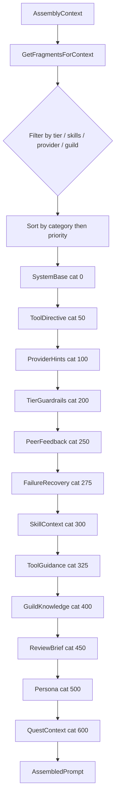

# Domain System

Semdragons is a workflow framework, not a workflow theme. The same quest board, XP engine,
boss battle evaluator, and boid coordination logic operate regardless of whether your agents
are "developers" completing "tasks" or "adventurers" completing "quests." Domains provide
the vocabulary and behavioral instructions that make the framework feel native to a specific
context.

## Why Domains Matter

Three things change when you switch domains, and nothing else does:

1. **Terminology** — The UI, API responses, and log output use the domain's vocabulary.
   `board.Vocab("quest")` returns `"Task"` for the software domain and `"Study"` for research.
   The underlying data model is identical.

2. **Skill taxonomy** — The set of valid skill tags for that board, the labels shown in the
   UI, and the descriptions injected into agent prompts all come from the domain's `Skills`
   list. A quest that requires `code_generation` on a software board routes to agents with
   that skill; the same tag is meaningless on a D&D board.

3. **Prompt content** — The `DomainCatalog` provides the actual text injected into every
   agent's system prompt: who they are, what they're allowed to do at each trust tier, how
   they should approach each required skill, and how the LLM-as-judge should evaluate their
   output. Swapping a domain catalog changes agent behavior without touching any code.

Everything else — the quest lifecycle, XP calculations, boss battle scoring, boid rules,
DAG execution — is domain-agnostic.

This document describes how domains work, what the three built-in domains provide, and how
to add a custom domain.

## Contents

- [Why Domains Matter](#why-domains-matter)
- [What a Domain Is](#what-a-domain-is)
- [DomainConfig vs DomainCatalog](#domainconfig-vs-domaincatalog)
- [Built-in Domains](#built-in-domains)
  - [Software Development](#software-development)
  - [Dungeons and Dragons](#dungeons-and-dragons)
  - [Research and Analysis](#research-and-analysis)
- [Prompt Assembly](#prompt-assembly)
- [Fragment Categories](#fragment-categories)
- [Provider-Aware Formatting](#provider-aware-formatting)
- [Adding a Custom Domain](#adding-a-custom-domain)

---

## What a Domain Is

A domain has two responsibilities:

1. **Schema** — define what skills exist in this context and what the framework calls its
   entities. This is `domain.Config` (aliased as `semdragons.DomainConfig`).

2. **Content** — provide the actual prompt text that instructs LLM agents how to behave in
   this context. This is `promptmanager.DomainCatalog`.

The two types are kept separate because schema is structural (validated, referenced by ID in
quest definitions) while content is textual (swappable, optionally overridden per agent).

Domains live in the `domains/` package alongside the `domain/` package, which defines the
primitive types both share.

```
domains/
  software.go    — SoftwareDomain (Config) + SoftwarePromptCatalog (DomainCatalog)
  dnd.go         — DnDDomain     (Config) + DnDPromptCatalog     (DomainCatalog)
  research.go    — ResearchDomain (Config) + ResearchPromptCatalog (DomainCatalog)

domain/
  types.go       — SkillTag, TrustTier, PartyRole, QuestStatus, ... (primitive enums)
  config.go      — domain.Config, domain.Vocabulary, domain.Skill, BoardConfig
```

---

## DomainConfig vs DomainCatalog

### DomainConfig (schema)

`domain.Config` declares the structure of a domain. It is stored in `BoardConfig.Domain`
and consulted whenever the framework needs to render a term or validate a skill.

```go
type Config struct {
    ID          ID         // "software", "dnd", "research"
    Name        string     // Human-readable display name
    Description string
    Skills      []Skill    // Skills valid in this domain
    Vocabulary  Vocabulary // Terminology overrides
}

type Vocabulary struct {
    Agent      string // "Developer", "Adventurer", "Researcher"
    Quest      string // "Task", "Quest", "Study"
    Party      string // "Team", "Party", "Research Group"
    Guild      string // "Guild", "Guild", "Lab"
    BossBattle string // "Code Review", "Boss Battle", "Peer Review"
    XP         string // "Points", "XP", "Credits"
    Level      string // "Seniority", "Level", "Grade"
    TierNames  map[TrustTier]string // Tier-specific display names
    RoleNames  map[PartyRole]string // Role-specific display names
}
```

`BoardConfig.Vocab(key)` and `BoardConfig.TierName(tier)` consult this configuration at
runtime. UI components and log output use these values, so the dashboard displays "Task"
instead of "Quest" when the software domain is active.

Skills defined here form the skill pool for the board. Quest definitions reference skill tags,
and the boid engine uses them to compute agent-quest affinity scores. The domain's skill list
is also the source of truth for what the UI renders as available skills when posting a quest.

### DomainCatalog (content)

`promptmanager.DomainCatalog` pairs with a `DomainConfig` to supply the text fragments that
get assembled into system prompts when an agent executes a quest.

```go
type DomainCatalog struct {
    DomainID      domain.ID

    // "You are an autonomous developer in a software engineering team."
    SystemBase    string

    // Per-tier behavioral guardrails using domain vocabulary.
    TierGuardrails map[domain.TrustTier]string

    // Per-skill instructions injected when a quest requires that skill.
    SkillFragments map[domain.SkillTag]string

    // Frames the LLM-as-judge role for boss battle evaluation.
    JudgeSystemBase string
}
```

The catalog is registered with `PromptRegistry.RegisterDomainCatalog()`. The registry
converts each field into typed `PromptFragment` records with the appropriate gating
metadata applied automatically.

---

## Built-in Domains

### Software Development

**Domain ID**: `software`

Models agents as members of a software engineering team. Uses career-track vocabulary
(Junior, Mid-Level, Senior, Staff, Principal) aligned to the five trust tiers.

**Vocabulary mapping:**

| Framework term | Software term |
|----------------|---------------|
| Agent          | Developer     |
| Quest          | Task          |
| Party          | Team          |
| Guild          | Guild         |
| Boss Battle    | Code Review   |
| XP             | Points        |
| Level          | Seniority     |

**Role names:**

| Role      | Software term |
|-----------|---------------|
| Lead      | Tech Lead     |
| Executor  | Developer     |
| Reviewer  | Reviewer      |
| Scout     | Researcher    |

**Tier names:**

| Tier        | Display name |
|-------------|--------------|
| Apprentice  | Junior       |
| Journeyman  | Mid-Level    |
| Expert      | Senior       |
| Master      | Staff        |
| Grandmaster | Principal    |

**Skills:**

| Tag                    | Name                 | Description                          |
|------------------------|----------------------|--------------------------------------|
| `code_generation`      | Coding               | Write and generate code              |
| `code_review`          | Code Review          | Review code quality                  |
| `data_transformation`  | Data Transformation  | Transform and process data           |
| `planning`             | Planning             | Technical planning and estimation    |
| `analysis`             | Analysis             | Analyze systems and requirements     |
| `research`             | Research             | Technical research and investigation |
| `summarization`        | Documentation        | Write technical docs and summaries   |
| `training`             | Mentoring            | Train and mentor other developers    |

All skill tags in the software domain use the core `SkillTag` constants from `domain/types.go`.
A quest that requires `SkillCodeGen` routes to agents with that skill and injects the coding
skill fragment into their system prompt.

**Tier guardrail example (Apprentice):**

```
You are a Junior Developer. Your capabilities are limited:
- You may ONLY read, summarize, classify, and analyze code
- You may NOT write to production systems, deploy, or make financial decisions
- Ask for guidance when uncertain about scope
- Focus on accuracy over speed
```

**Boss battle judge framing**: When a quest is submitted for review, the `bossbattle` processor
runs an LLM-as-judge evaluation. The judge's system prompt opens with the domain's
`JudgeSystemBase` to set the evaluator's persona:

> You are a senior code reviewer evaluating a developer's work output.

The evaluation rubric (criteria, weights, thresholds) and scoring instructions are appended
automatically by `AssembleJudgePrompt`. See the [prompt assembly](#prompt-assembly) section for
the full pipeline.

---

### Dungeons and Dragons

**Domain ID**: `dnd`

Models agents as adventurers in a classic fantasy setting. Tier names: Novice, Adventurer,
Veteran, Hero, Legend. Boss battle judge: "You are an ancient sage evaluating an
adventurer's quest performance."

All skills are domain-local strings (`melee`, `ranged`, `arcana`, `healing`, `stealth`,
`tactics`, `perception`, `persuasion`) — none overlap with the software or research
domains. This is by design: a D&D quest that requires `"melee"` will not match a software
agent who has `code_generation`.

---

### Research and Analysis

**Domain ID**: `research`

Models agents as researchers. Vocabulary: Researcher / Study / Research Group / Lab /
Peer Review / Credits / Grade. Tier names: Research Assistant, Associate, Senior
Researcher, Principal Investigator, Distinguished Fellow.

Skills mix core constants (`analysis`, `research`, `summarization`, `planning`) with
domain-local tags (`fact_check`, `statistics`, `visualization`, `interviewing`). When the
board runs the research domain, a quest requiring `SkillAnalysis` injects the *research*
catalog's analysis fragment — not the software one.

**Boss battle judge framing**: "You are a peer reviewer evaluating a researcher's study
output for methodological rigor and contribution."

---

## Agent Archetypes

Every agent has an **archetype** — a fixed class identity assigned at creation that never
changes when the agent levels up. Leveling improves proficiency within the class; it does
not change the class itself.

| Archetype | Primary Skill | Secondary Skills | Role |
|-----------|--------------|------------------|------|
| **Engineer** | `code_generation` | `code_review`, `data_transformation` | Implement, test, review code |
| **Scholar** | `research` | `analysis`, `summarization` | Research, analyze, synthesize |
| **Strategist** | `planning` | `analysis`, `research` | System design, decomposition |
| **Scribe** | `summarization` | `customer_communications`, `training` | Documentation, communications |

Archetypes affect the system in three places:

1. **Prompt fragment selection** — the `promptmanager` uses archetype to gate conditional
   fragments. An Engineer gets implementation-oriented directives; a Scholar gets
   research-oriented ones.

2. **Entity knowledge injection** — `questbridge` injects the agent's archetype into the
   structured context block so the agent is self-aware of its class identity and
   specialization.

3. **Dashboard display** — the UI shows archetype badges on agent cards and a class
   distribution chart on the DM dashboard, giving the DM visibility into team composition.

The mapping from primary skill to archetype is defined in `domain/types.go`
(`ArchetypeForSkill`). When seeding agents, the seeder assigns an archetype based on the
agent's highest-weighted skill. Agents with skills that don't map to a canonical archetype
(e.g., domain-local skills like `fact_check`) are left unclassed.

---

## Prompt Assembly

When `questbridge` dispatches a quest to an agent, it calls `promptmanager.PromptAssembler`
to build the system prompt. The assembler takes an `AssemblyContext` (agent tier, skills,
guilds, quest details, peer feedback, provider) and produces an `AssembledPrompt` containing
a system message, a user message, and the list of fragment IDs used (for observability).

Assembly proceeds in a fixed order:



Agent-level overrides (`SystemPrompt`, `PersonaPrompt`) and the quest context block are
appended after all registry fragments. They represent the "last word" in the prompt and
are never stored in the registry.

The assembled result exposes `SystemMessage`, `UserMessage`, and `FragmentsUsed` (the list
of fragment IDs included, useful for observability in trajectories).

---

## Fragment Categories

The ordering system uses integer constants. Lower values appear earlier in the assembled
prompt.

| Constant                  | Value | Purpose                                                             |
|---------------------------|-------|---------------------------------------------------------------------|
| `CategorySystemBase`      | 0     | Domain identity ("You are a developer in a software team.")         |
| `CategoryToolDirective`   | 50    | Mandatory tool-call instructions (e.g., party lead must call `decompose_quest` first) |
| `CategoryProviderHints`   | 100   | Provider-specific formatting hints (registered manually)            |
| `CategoryTierGuardrails`  | 200   | Behavioral bounds for the agent's trust tier                        |
| `CategoryPeerFeedback`    | 250   | Low-rated peer review warnings (injected at runtime from context)   |
| `CategoryFailureRecovery` | 275   | Previous attempt failure context, salvaged output, anti-patterns    |
| `CategorySkillContext`    | 300   | Task-specific instructions for each required skill                  |
| `CategoryToolGuidance`    | 325   | Advisory guidance on when to use which tool                         |
| `CategoryGuildKnowledge`  | 400   | Guild library fragments (registered per-guild)                      |
| `CategoryReviewBrief`     | 450   | Compact summary of how the agent's work will be evaluated           |
| `CategoryPersona`         | 500   | Agent character or personality overrides                            |
| `CategoryQuestContext`    | 600   | Quest title, description, time limit, token budget                  |

`RegisterDomainCatalog` assigns categories automatically:

- `SystemBase` → `CategorySystemBase`, no gating
- Each `TierGuardrails[tier]` → `CategoryTierGuardrails`, gated `MinTier=MaxTier=tier`
- Each `SkillFragments[skill]` → `CategorySkillContext`, gated to `Skills=[skill]`

`CategoryToolDirective` and `CategoryFailureRecovery` are used by built-in fragments
registered via `RegisterBuiltinFragments` (called in `questbridge`). They are not part
of the domain catalog — they carry runtime context (party role, failure history) that
domain authors do not control.

Custom fragments registered directly via `registry.Register(&PromptFragment{...})` can
use any category and any gating combination.

### Fragment gating

A fragment is included in a prompt only when all of its gate conditions pass:

| Gate field  | Match condition                                          |
|-------------|----------------------------------------------------------|
| `MinTier`   | `ctx.Tier >= MinTier` (nil = no lower bound)            |
| `MaxTier`   | `ctx.Tier <= MaxTier` (nil = no upper bound)            |
| `Skills`    | Agent has at least one skill in the fragment's list (empty = any) |
| `Providers` | `ctx.Provider` is in the list (empty = any)             |
| `GuildID`   | Agent belongs to the specified guild (nil = any)         |

Tier guardrails are gated to exactly one tier (`MinTier=MaxTier=tier`), so only the
guardrail matching the agent's current tier is included. Skill fragments are gated to a
single skill tag; only the skills required by the quest (or present in the agent's skill
map) match.

---

## Provider-Aware Formatting

The assembler wraps each section in delimiters appropriate for the target LLM provider.
Provider styles are registered by calling `registry.RegisterProviderStyles()`.

| Provider    | Format    | Section wrapper                        |
|-------------|-----------|----------------------------------------|
| `anthropic` | XML       | `<tier_guardrails>...</tier_guardrails>` |
| `openai`    | Markdown  | `## Tier Guardrails\n...`              |
| `ollama`    | Markdown  | `## Tier Guardrails\n...`              |
| (other)     | Plain     | `Tier Guardrails:\n...`                |

The label used as the XML tag or markdown header comes from `categoryLabel()` and is the
human-readable string for each category (e.g., "Tier Guardrails", "Skills", "Quest").

Judge prompts produced by `AssembleJudgePrompt` follow the same provider convention. The
evaluation rubric is formatted as an XML `<criterion>` list for Anthropic and a markdown
table for OpenAI/Ollama.

---

## Adding a Custom Domain

The four steps below apply to any new domain. Use `domains/software.go` as the concrete
reference implementation.

### 1. Define the config and catalog

Create `domains/legal.go` with two variables:

```go
// DomainConfig — vocabulary, skill taxonomy, tier names
var LegalDomain = domain.Config{
    ID: "legal",
    Skills: []domain.Skill{
        {Tag: domain.SkillAnalysis, Name: "Legal Analysis", Description: "..."},
        {Tag: "contract_review",    Name: "Contract Review", Description: "..."},
    },
    Vocabulary: domain.Vocabulary{
        Agent: "Associate", Quest: "Matter", BossBattle: "Partner Review",
        TierNames: map[domain.TrustTier]string{
            domain.TierApprentice: "1st Year", domain.TierGrandmaster: "Partner",
        },
    },
}

// DomainCatalog — prompt text for each tier, skill, and judge role
var LegalPromptCatalog = promptmanager.DomainCatalog{
    DomainID:        "legal",
    SystemBase:      "You are an associate at a law firm...",
    TierGuardrails:  map[domain.TrustTier]string{ /* one entry per tier */ },
    SkillFragments:  map[domain.SkillTag]string{ /* one entry per skill tag */ },
    JudgeSystemBase: "You are a senior partner reviewing an associate's work product.",
}
```

### 2. Load the catalog at startup

In `cmd/semdragons/main.go`:

```go
registry := promptmanager.NewPromptRegistry()
registry.RegisterProviderStyles()
registry.RegisterDomainCatalog(&domains.LegalPromptCatalog)
```

### 3. Configure the board

Set `BoardConfig.Domain` to point at `LegalDomain`:

```go
board := domain.BoardConfig{
    Org:      "acme",
    Platform: "prod",
    Board:    "legal-main",
    Domain:   &domains.LegalDomain,
}
```

From this point, `board.Vocab("quest")` returns `"Matter"`, tier names display as firm
seniority levels, and quests that require `"contract_review"` inject the contract review
skill fragment into the agent's system prompt.

### Design notes

- **Skill tags**: Mix core constants with domain-local strings freely. Core constants
  (`domain.SkillAnalysis`, etc.) are reused across domains — only the *fragment text*
  differs per catalog. Domain-local strings (`"contract_review"`) are invisible to other
  domains' quests.

- **Tier coverage**: You do not need to define all five tiers in `TierGuardrails`. Agents
  whose tier has no guardrail text receive only the system base and skill fragments.
  Missing guardrail entries are silently skipped.

- **JudgeSystemBase**: This string frames the LLM-as-judge role during boss battles. Keep
  it short (one sentence) and use domain vocabulary. The evaluation rubric and scoring
  instructions are appended automatically by `AssembleJudgePrompt`.

- **Vocabulary fallback**: Any vocabulary key not set in the domain falls back to the
  default RPG terms ("Quest", "Agent", "XP"). Partial vocabulary definitions are valid.
