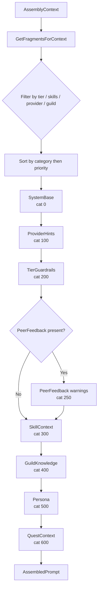

# Domain System

Semdragons is a workflow framework, not a workflow theme. The same quest board, XP engine,
boss battle evaluator, and boid coordination logic operate regardless of whether your agents
are "developers" completing "tasks" or "adventurers" completing "quests." Domains provide
the vocabulary and behavioral instructions that make the framework feel native to a specific
context.

This document describes how domains work, what the three built-in domains provide, and how
to add a custom domain.

## Contents

- [What a Domain Is](#what-a-domain-is)
- [DomainConfig vs DomainCatalog](#domainconfig-vs-domaincatalog)
- [Built-in Domains](#built-in-domains)
  - [Software Development](#software-development)
  - [Dungeons and Dragons](#dungeons-and-dragons)
  - [Research and Analysis](#research-and-analysis)
- [Prompt Assembly](#prompt-assembly)
- [Fragment Categories](#fragment-categories)
- [Provider-Aware Formatting](#provider-aware-formatting)
- [Adding a Custom Domain](#adding-a-custom-domain)

---

## What a Domain Is

A domain has two responsibilities:

1. **Schema** — define what skills exist in this context and what the framework calls its
   entities. This is `domain.Config` (aliased as `semdragons.DomainConfig`).

2. **Content** — provide the actual prompt text that instructs LLM agents how to behave in
   this context. This is `promptmanager.DomainCatalog`.

The two types are kept separate because schema is structural (validated, referenced by ID in
quest definitions) while content is textual (swappable, optionally overridden per agent).

Domains live in the `domains/` package alongside the `domain/` package, which defines the
primitive types both share.

```
domains/
  software.go    — SoftwareDomain (Config) + SoftwarePromptCatalog (DomainCatalog)
  dnd.go         — DnDDomain     (Config) + DnDPromptCatalog     (DomainCatalog)
  research.go    — ResearchDomain (Config) + ResearchPromptCatalog (DomainCatalog)

domain/
  types.go       — SkillTag, TrustTier, PartyRole, QuestStatus, ... (primitive enums)
  config.go      — domain.Config, domain.Vocabulary, domain.Skill, BoardConfig
```

---

## DomainConfig vs DomainCatalog

### DomainConfig (schema)

`domain.Config` declares the structure of a domain. It is stored in `BoardConfig.Domain`
and consulted whenever the framework needs to render a term or validate a skill.

```go
type Config struct {
    ID          ID         // "software", "dnd", "research"
    Name        string     // Human-readable display name
    Description string
    Skills      []Skill    // Skills valid in this domain
    Vocabulary  Vocabulary // Terminology overrides
}

type Vocabulary struct {
    Agent      string // "Developer", "Adventurer", "Researcher"
    Quest      string // "Task", "Quest", "Study"
    Party      string // "Team", "Party", "Research Group"
    Guild      string // "Guild", "Guild", "Lab"
    BossBattle string // "Code Review", "Boss Battle", "Peer Review"
    XP         string // "Points", "XP", "Credits"
    Level      string // "Seniority", "Level", "Grade"
    TierNames  map[TrustTier]string // Tier-specific display names
    RoleNames  map[PartyRole]string // Role-specific display names
}
```

`BoardConfig.Vocab(key)` and `BoardConfig.TierName(tier)` consult this configuration at
runtime. UI components and log output use these values, so the dashboard displays "Task"
instead of "Quest" when the software domain is active.

Skills defined here form the skill pool for the board. Quest definitions reference skill tags,
and the boid engine uses them to compute agent-quest affinity scores. The domain's skill list
is also the source of truth for what the UI renders as available skills when posting a quest.

### DomainCatalog (content)

`promptmanager.DomainCatalog` pairs with a `DomainConfig` to supply the text fragments that
get assembled into system prompts when an agent executes a quest.

```go
type DomainCatalog struct {
    DomainID      domain.ID

    // "You are an autonomous developer in a software engineering team."
    SystemBase    string

    // Per-tier behavioral guardrails using domain vocabulary.
    TierGuardrails map[domain.TrustTier]string

    // Per-skill instructions injected when a quest requires that skill.
    SkillFragments map[domain.SkillTag]string

    // Frames the LLM-as-judge role for boss battle evaluation.
    JudgeSystemBase string
}
```

The catalog is registered with `PromptRegistry.RegisterDomainCatalog()`. The registry
converts each field into typed `PromptFragment` records with the appropriate gating
metadata applied automatically.

---

## Built-in Domains

### Software Development

**Domain ID**: `software`

Models agents as members of a software engineering team. Uses career-track vocabulary
(Junior, Mid-Level, Senior, Staff, Principal) aligned to the five trust tiers.

**Vocabulary mapping:**

| Framework term | Software term |
|----------------|---------------|
| Agent          | Developer     |
| Quest          | Task          |
| Party          | Team          |
| Guild          | Guild         |
| Boss Battle    | Code Review   |
| XP             | Points        |
| Level          | Seniority     |

**Tier names:**

| Tier        | Display name |
|-------------|--------------|
| Apprentice  | Junior       |
| Journeyman  | Mid-Level    |
| Expert      | Senior       |
| Master      | Staff        |
| Grandmaster | Principal    |

**Skills:**

| Tag                    | Name                 | Description                        |
|------------------------|----------------------|------------------------------------|
| `code_generation`      | Coding               | Write and generate code            |
| `code_review`          | Code Review          | Review code quality                |
| `data_transformation`  | Data Transformation  | Transform and process data         |
| `planning`             | Planning             | Technical planning and estimation  |
| `analysis`             | Analysis             | Analyze systems and requirements   |
| `research`             | Research             | Technical research and investigation |
| `summarization`        | Documentation        | Write technical docs and summaries |
| `training`             | Mentoring            | Train and mentor other developers  |

All skill tags in the software domain use the core `SkillTag` constants from `domain/types.go`.
A quest that requires `SkillCodeGen` routes to agents with that skill and injects the coding
skill fragment into their system prompt.

**Tier guardrail example (Apprentice):**

```
You are a Junior Developer. Your capabilities are limited:
- You may ONLY read, summarize, classify, and analyze code
- You may NOT write to production systems, deploy, or make financial decisions
- Ask for guidance when uncertain about scope
- Focus on accuracy over speed
```

**Boss battle judge framing**: When a quest is submitted for review, the `bossbattle` processor
runs an LLM-as-judge evaluation. The judge's system prompt opens with the domain's
`JudgeSystemBase` to set the evaluator's persona:

> You are a senior code reviewer evaluating a developer's work output.

The evaluation rubric (criteria, weights, thresholds) and scoring instructions are appended
automatically by `AssembleJudgePrompt`. See the [prompt assembly](#prompt-assembly) section for
the full pipeline.

---

### Dungeons and Dragons

**Domain ID**: `dnd`

Models agents as adventurers in a classic fantasy setting. This domain intentionally uses
skill tags that are *not* in the core `SkillTag` constants — different domains can define
entirely different skill sets using arbitrary string tags.

**Vocabulary mapping:**

| Framework term | D&D term     |
|----------------|--------------|
| Agent          | Adventurer   |
| Quest          | Quest        |
| Party          | Party        |
| Guild          | Guild        |
| Boss Battle    | Boss Battle  |
| XP             | XP           |
| Level          | Level        |

**Tier names:**

| Tier        | Display name |
|-------------|--------------|
| Apprentice  | Novice       |
| Journeyman  | Adventurer   |
| Expert      | Veteran      |
| Master      | Hero         |
| Grandmaster | Legend       |

**Skills:**

| Tag          | Name           | Description                       |
|--------------|----------------|-----------------------------------|
| `melee`      | Melee Combat   | Sword and axe fighting            |
| `ranged`     | Ranged Combat  | Bows and thrown weapons           |
| `arcana`     | Arcana         | Magical knowledge and spells      |
| `healing`    | Healing        | Restore health and cure ailments  |
| `stealth`    | Stealth        | Move unseen and unheard           |
| `tactics`    | Tactics        | Battle strategy and leadership    |
| `perception` | Perception     | Notice hidden details             |
| `persuasion` | Persuasion     | Convince and negotiate            |

None of these tags are defined in `domain/types.go`. They are domain-local strings. This
is by design — a D&D quest that requires `"melee"` skill will not match agents from the
software domain who have `code_generation` skill, even though both are valid skill tags
within their respective domains.

**Boss battle judge framing**:

> You are an ancient sage evaluating an adventurer's quest performance.

---

### Research and Analysis

**Domain ID**: `research`

Models agents as researchers conducting rigorous investigation. This domain mixes core
skill tags with domain-specific ones, illustrating the hybrid approach.

**Vocabulary mapping:**

| Framework term | Research term       |
|----------------|---------------------|
| Agent          | Researcher          |
| Quest          | Study               |
| Party          | Research Group      |
| Guild          | Lab                 |
| Boss Battle    | Peer Review         |
| XP             | Credits             |
| Level          | Grade               |

**Tier names:**

| Tier        | Display name             |
|-------------|--------------------------|
| Apprentice  | Research Assistant       |
| Journeyman  | Associate                |
| Expert      | Senior Researcher        |
| Master      | Principal Investigator   |
| Grandmaster | Distinguished Fellow     |

**Skills:**

| Tag             | Source       | Name              | Description                            |
|-----------------|--------------|-------------------|----------------------------------------|
| `analysis`      | core         | Analysis          | Analyze data and find patterns         |
| `research`      | core         | Research          | Find and gather information            |
| `summarization` | core         | Synthesis         | Combine sources into insights          |
| `planning`      | core         | Study Design      | Plan research methodology              |
| `fact_check`    | domain-local | Fact Checking     | Verify claims and sources              |
| `statistics`    | domain-local | Statistics        | Statistical analysis and modeling      |
| `visualization` | domain-local | Visualization     | Create charts and diagrams             |
| `interviewing`  | domain-local | Interviewing      | Gather information from sources        |

The four core skills (`analysis`, `research`, `summarization`, `planning`) use the same
tags as the software domain. If a quest is defined with `SkillAnalysis` and the board is
configured for the research domain, the research skill fragment is injected — not the
software one — because the research catalog's `SkillFragments` map overrides the text.

**Boss battle judge framing**:

> You are a peer reviewer evaluating a researcher's study output for methodological rigor
> and contribution.

---

## Prompt Assembly

When `questbridge` dispatches a quest to an agent, it calls `promptmanager.PromptAssembler`
to build the system prompt. The assembler takes an `AssemblyContext` and produces an
`AssembledPrompt` containing a system message, a user message, and the list of fragment IDs
used (for observability).

```go
type AssemblyContext struct {
    // Agent identity
    AgentID       domain.AgentID
    Tier          domain.TrustTier
    Level         int
    Skills        map[domain.SkillTag]domain.SkillProficiency
    Guilds        []domain.GuildID
    SystemPrompt  string  // per-agent override
    PersonaPrompt string  // per-agent persona

    // Quest details
    QuestTitle       string
    QuestDescription string
    QuestInput       any
    RequiredSkills   []domain.SkillTag
    MaxDuration      string
    MaxTokens        int

    // Low-rated peer feedback warnings (optional)
    PeerFeedback []PeerFeedbackSummary

    // LLM provider ("anthropic", "openai", "ollama")
    Provider string
}
```

Assembly proceeds in a fixed order:



Agent-level overrides (`SystemPrompt`, `PersonaPrompt`) and the quest context block are
appended after all registry fragments. They represent the "last word" in the prompt and
are never stored in the registry.

The complete assembly call:

```go
registry := promptmanager.NewPromptRegistry()
registry.RegisterProviderStyles()
registry.RegisterDomainCatalog(&domains.SoftwarePromptCatalog)

assembler := promptmanager.NewPromptAssembler(registry)

prompt := assembler.AssembleSystemPrompt(promptmanager.AssemblyContext{
    AgentID:          agentID,
    Tier:             domain.TierExpert,
    Skills:           agent.Skills,
    RequiredSkills:   quest.RequiredSkills,
    QuestTitle:       quest.Title,
    QuestDescription: quest.Description,
    Provider:         "anthropic",
})
// prompt.SystemMessage → assembled system prompt
// prompt.UserMessage   → quest input or description
// prompt.FragmentsUsed → ["software.system-base", "software.tier-guardrails.expert", ...]
```

---

## Fragment Categories

The ordering system uses integer constants. Lower values appear earlier in the assembled
prompt.

| Constant                | Value | Purpose                                                        |
|-------------------------|-------|----------------------------------------------------------------|
| `CategorySystemBase`    | 0     | Domain identity ("You are a developer in a software team.")    |
| `CategoryProviderHints` | 100   | Provider-specific formatting hints (registered manually)       |
| `CategoryTierGuardrails`| 200   | Behavioral bounds for the agent's trust tier                   |
| `CategoryPeerFeedback`  | 250   | Low-rated peer review warnings (injected at runtime, not stored in registry) |
| `CategorySkillContext`  | 300   | Task-specific instructions for each required skill             |
| `CategoryGuildKnowledge`| 400   | Guild library fragments (registered per-guild)                 |
| `CategoryPersona`       | 500   | Agent character or personality overrides                       |
| `CategoryQuestContext`  | 600   | Quest title, description, time limit, token budget             |

`RegisterDomainCatalog` assigns categories automatically:

- `SystemBase` → `CategorySystemBase`, no gating
- Each `TierGuardrails[tier]` → `CategoryTierGuardrails`, gated `MinTier=MaxTier=tier`
- Each `SkillFragments[skill]` → `CategorySkillContext`, gated to `Skills=[skill]`

Custom fragments registered directly via `registry.Register(&PromptFragment{...})` can
use any category and any gating combination.

### Fragment gating

A fragment is included in a prompt only when all of its gate conditions pass:

| Gate field  | Match condition                                          |
|-------------|----------------------------------------------------------|
| `MinTier`   | `ctx.Tier >= MinTier` (nil = no lower bound)            |
| `MaxTier`   | `ctx.Tier <= MaxTier` (nil = no upper bound)            |
| `Skills`    | Agent has at least one skill in the fragment's list (empty = any) |
| `Providers` | `ctx.Provider` is in the list (empty = any)             |
| `GuildID`   | Agent belongs to the specified guild (nil = any)         |

Tier guardrails are gated to exactly one tier (`MinTier=MaxTier=tier`), so only the
guardrail matching the agent's current tier is included. Skill fragments are gated to a
single skill tag; only the skills required by the quest (or present in the agent's skill
map) match.

---

## Provider-Aware Formatting

The assembler wraps each section in delimiters appropriate for the target LLM provider.
Provider styles are registered by calling `registry.RegisterProviderStyles()`.

| Provider    | Format    | Section wrapper                        |
|-------------|-----------|----------------------------------------|
| `anthropic` | XML       | `<tier_guardrails>...</tier_guardrails>` |
| `openai`    | Markdown  | `## Tier Guardrails\n...`              |
| `ollama`    | Markdown  | `## Tier Guardrails\n...`              |
| (other)     | Plain     | `Tier Guardrails:\n...`                |

The label used as the XML tag or markdown header comes from `categoryLabel()` and is the
human-readable string for each category (e.g., "Tier Guardrails", "Skills", "Quest").

Judge prompts produced by `AssembleJudgePrompt` follow the same provider convention. The
evaluation rubric is formatted as an XML `<criterion>` list for Anthropic and a markdown
table for OpenAI/Ollama.

---

## Adding a Custom Domain

The steps below create a hypothetical `legal` domain.

### 1. Define the config and catalog

Create `domains/legal.go`:

```go
package domains

import (
    "github.com/c360studio/semdragons"
    "github.com/c360studio/semdragons/domain"
    "github.com/c360studio/semdragons/processor/promptmanager"
)

const DomainLegal domain.ID = "legal"

var LegalDomain = semdragons.DomainConfig{
    ID:          DomainLegal,
    Name:        "Legal Practice",
    Description: "Draft, review, and analyze legal documents",
    Skills: []semdragons.DomainSkill{
        {Tag: domain.SkillAnalysis,      Name: "Legal Analysis",   Description: "Analyze statutes and case law"},
        {Tag: domain.SkillResearch,      Name: "Legal Research",   Description: "Research precedents and regulations"},
        {Tag: domain.SkillSummarization, Name: "Brief Writing",    Description: "Summarize complex legal matters"},
        {Tag: "contract_review",         Name: "Contract Review",  Description: "Review and redline contracts"},
        {Tag: "deposition",              Name: "Deposition Prep",  Description: "Prepare witness examinations"},
    },
    Vocabulary: semdragons.DomainVocabulary{
        Agent:      "Associate",
        Quest:      "Matter",
        Party:      "Practice Group",
        Guild:      "Firm",
        BossBattle: "Partner Review",
        XP:         "Billable Credits",
        Level:      "Year",
        TierNames: map[semdragons.TrustTier]string{
            semdragons.TierApprentice:  "1st Year",
            semdragons.TierJourneyman:  "3rd Year",
            semdragons.TierExpert:      "Senior Associate",
            semdragons.TierMaster:      "Of Counsel",
            semdragons.TierGrandmaster: "Partner",
        },
        RoleNames: map[semdragons.PartyRole]string{
            semdragons.RoleLead:     "Lead Counsel",
            semdragons.RoleExecutor: "Associate",
            semdragons.RoleReviewer: "Supervising Partner",
            semdragons.RoleScout:    "Paralegal",
        },
    },
}

var LegalPromptCatalog = promptmanager.DomainCatalog{
    DomainID: DomainLegal,

    SystemBase: "You are an associate at a law firm. Complete the assigned matter " +
        "with precision and strict adherence to professional standards.",

    TierGuardrails: map[semdragons.TrustTier]string{
        semdragons.TierApprentice: "You are a 1st Year Associate:\n" +
            "- You may ONLY research, summarize, and draft under supervision\n" +
            "- You may NOT advise clients directly or sign filings\n" +
            "- Always get partner sign-off before sending",
        semdragons.TierExpert: "You are a Senior Associate:\n" +
            "- You may advise clients on standard matters\n" +
            "- You may negotiate routine contract terms\n" +
            "- Flag unusual clauses to partners immediately",
        semdragons.TierGrandmaster: "You are a Partner:\n" +
            "- You may make final decisions on client strategy\n" +
            "- You may represent the firm in court\n" +
            "- Your signature binds the firm",
    },

    SkillFragments: map[semdragons.SkillTag]string{
        domain.SkillAnalysis:      "Analyze applicable statutes, regulations, and precedent. Cite sources.",
        domain.SkillResearch:      "Research using primary sources. Note jurisdiction. Flag conflicting authority.",
        domain.SkillSummarization: "Write clearly. Use plain English where possible. State the bottom line first.",
        "contract_review":         "Identify non-standard terms. Redline with explanations. Flag risk clauses.",
        "deposition":              "Prepare open and closed questions. Anticipate objections. Note key admissions.",
    },

    JudgeSystemBase: "You are a senior partner reviewing an associate's work product for accuracy and risk.",
}
```

### 2. Register the domain ID

Add the constant to `domain/config.go` (or keep it in `domains/legal.go` if the domain is
optional):

```go
const (
    DomainSoftware ID = "software"
    DomainDnD      ID = "dnd"
    DomainResearch ID = "research"
    DomainLegal    ID = "legal"   // add here only if it becomes a standard domain
)
```

### 3. Load the catalog at startup

In `cmd/semdragons/main.go` (or wherever your service initializes the prompt registry):

```go
registry := promptmanager.NewPromptRegistry()
registry.RegisterProviderStyles()
registry.RegisterDomainCatalog(&domains.LegalPromptCatalog)
```

### 4. Configure the board

Set `BoardConfig.Domain` to point at `LegalDomain`:

```go
board := domain.BoardConfig{
    Org:      "acme",
    Platform: "prod",
    Board:    "legal-main",
    Domain:   &domains.LegalDomain,
}
```

From this point, `board.Vocab("quest")` returns `"Matter"`, tier names display as firm
seniority levels, and quests that require `"contract_review"` inject the contract review
skill fragment into the agent's system prompt.

### Design notes

- **Skill tags**: Mix core constants with domain-local strings freely. Core constants
  (`domain.SkillAnalysis`, etc.) are reused across domains — only the *fragment text*
  differs per catalog. Domain-local strings (`"contract_review"`) are invisible to other
  domains' quests.

- **Tier coverage**: You do not need to define all five tiers in `TierGuardrails`. Agents
  whose tier has no guardrail text receive only the system base and skill fragments.
  Missing guardrail entries are silently skipped.

- **JudgeSystemBase**: This string frames the LLM-as-judge role during boss battles. Keep
  it short (one sentence) and use domain vocabulary. The evaluation rubric and scoring
  instructions are appended automatically by `AssembleJudgePrompt`.

- **Vocabulary fallback**: Any vocabulary key not set in the domain falls back to the
  default RPG terms ("Quest", "Agent", "XP"). Partial vocabulary definitions are valid.
